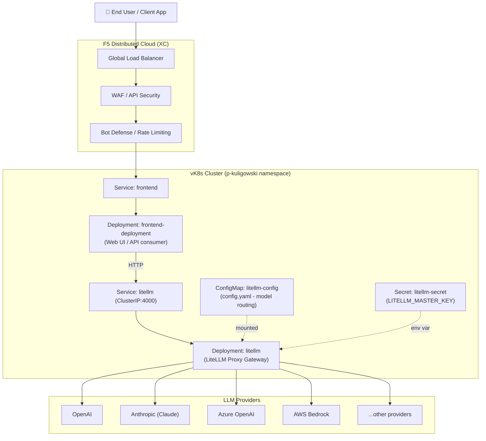

# F5 XC as AI Gateway
This repo/deployment demonstrates:
- Running **LiteLLM Proxy** as a containerized app on **Virtual Kubernetes (vk8s)**
- Routing/load-balancing across multiple LLM backends and models
- Publishing and securing the service using **F5 Distributed Cloud (XC)** for global load balancing, WAF, API security, and DDoS protection
- A simple **Sentence paraphraser AI app** consuming the gateway

# The APP

